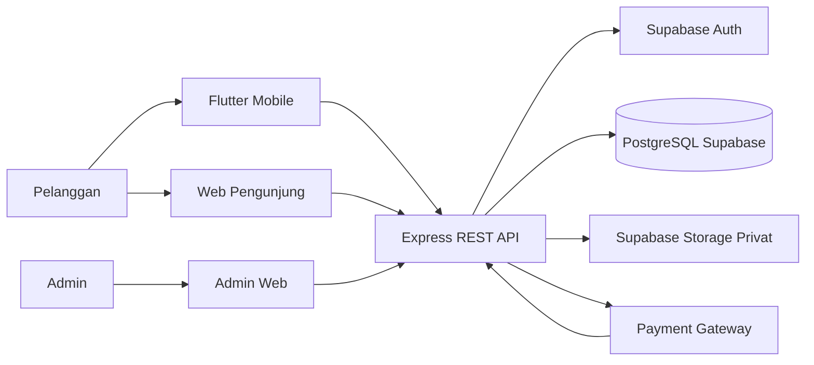

# Dokumentasi Proyek: Sistem Informasi E-Book dan SPK Berbasis Mobile (Metode SAW)

## A. Identitas Dokumen

- **Judul Proyek:** Sistem Informasi E-Commerce E-Book dan Sistem Pendukung Keputusan (SPK) Metode Simple Additive Weighting (SAW)
- **Status Proyek Keseluruhan:** Sebagian `[ADA]` (fondasi monorepo, kerangka `backend/`, skema & file migrasi awal `schema.prisma`, skrip seeding simulasi, 4 suite unit test Vitest, antarmuka `web/admin-web` Neo-Brutalism, etalase `web/pengunjung-web` 9 layar, modul `mobile/ebook_store` [Splash, Auth, Katalog, Beranda, Keranjang Belanja], serta 10 test suite Flutter); sebagian `[RENCANA]` (seluruh REST API bisnis backend, eksekusi migrasi live ke PostgreSQL Supabase remote, integrasi payment gateway nyata, penerbitan signed URL PDF privat backend, dan mesin kalkulasi SPK SAW).
- **Fungsi Dokumen:** Sumber kebenaran utama (_single source of truth_) dan indeks resmi status proyek.
- **Tanggal Pembaruan Terakhir:** 22 November 2026
- **Audiens Dokumen:** Dosen pembimbing/penilai akademik, pemilik proyek, tim pengembang (`backend`, `web`, `mobile`), QA, serta pihak nonteknis.

### Cara Membaca Status

| Label       | Arti                                                                                                  |
| ----------- | ----------------------------------------------------------------------------------------------------- |
| `[ADA]`     | Artefak, implementasi, atau pengujian telah tersedia dan dapat dibuktikan secara nyata di repository. |
| `[RENCANA]` | Belum diimplementasikan, masih dalam perancangan, atau masih membutuhkan keputusan final.             |

---

## B. Ringkasan Eksekutif

- **Masalah yang Diselesaikan:** Pengelolaan katalog `e-book`, transaksi pembelian daring, perlindungan file PDF dari akses bebas, serta pemilihan rekomendasi `e-book` secara objektif dan konsisten.
- **Solusi yang Dibangun:** Sistem informasi e-commerce `e-book` berbasis arsitektur _Client–Server_ terpusat dengan integrasi _payment gateway_ nyata, **Supabase Auth**, penyimpanan PDF pada **Supabase Storage `bucket privat`**, serta mesin rekomendasi **SPK SAW** yang berjalan eksklusif di `backend/`.
- **Model Bisnis:** _Single-Seller B2C_ (satu toko resmi menjual langsung ke pembeli; bukan _marketplace_ multi-vendor, lihat [ADR-0001](./adr/0001-single-seller-b2c.md)).
- **Aktor Utama:** **Pelanggan** (_Customer_) dan **Admin**.
- **Platform Utama:** Aplikasi mobile Android (`mobile/ebook_store`), portal web pelanggan (`web/pengunjung-web`), dan aplikasi web administrasi (`web/admin-web`).
- **Peran Backend:** Menjadi pusat otorisasi (`JWT` + `RBAC`), validasi input (**Zod**), pengelolaan pesanan & _webhook_ pembayaran idempoten, penerbitan `signed URL`, dan perhitungan `SPK SAW`.
- **Peran SAW:** Membantu **Pelanggan** memperoleh peringkat rekomendasi `e-book` berbasis kriteria terukur; perhitungan dikunci **hanya di `backend/`** ([ADR-0002](./adr/0002-backend-only-saw.md)).
- **Batasan Akses PDF:** File PDF disimpan di `bucket privat` dan hanya dapat dibaca di dalam aplikasi (_in-app PDF reader_) via `signed URL` sementara setelah `backend/` memvalidasi `EbookAccess` aktif.
- **Status Implementasi Umum:** Fondasi teknis `backend/` (`/api/v1/health`, `/api/v1/admin/ping`, middleware dasar, `schema.prisma`, migrasi awal, skrip seeding simulasi, dan 4 file unit test Vitest), antarmuka `web/admin-web` Neo-Brutalism, etalase `web/pengunjung-web` (9 layar lengkap), serta modul `mobile/ebook_store` (Splash, Auth, Katalog, Beranda, Keranjang Belanja) sudah `[ADA]`; seluruh modul bisnis REST API backend, integrasi payment gateway live, dan mesin kalkulasi SAW backend masih `[RENCANA]`.

---

## C. Arsitektur Ringkas

```mermaid
flowchart LR
    Customer["Pelanggan"]
    Admin["Admin"]

    Mobile["Flutter Mobile"]
    VisitorWeb["Web Pengunjung"]
    AdminWeb["Admin Web"]

    Backend["Express REST API"]
    Auth["Supabase Auth"]
    Database[("PostgreSQL Supabase")]
    Storage["Supabase Storage Privat"]
    Payment["Payment Gateway"]

    Customer --> Mobile
    Customer --> VisitorWeb
    Admin --> AdminWeb

    Mobile --> Backend
    VisitorWeb --> Backend
    AdminWeb --> Backend

    Backend --> Auth
    Backend --> Database
    Backend --> Storage
    Backend --> Payment
    Payment --> Backend
```

**Penjelasan Prinsip Arsitektur:**

- Aplikasi klien (`Flutter Mobile`, `Web Pengunjung`, `Admin Web`) **tidak boleh** mengakses PostgreSQL atau `Supabase Storage Privat` secara langsung.
- `Express REST API` (`backend/`) menangani otorisasi peran, transaksi database atomik, perhitungan `SPK SAW`, dan penerbitan `signed URL` sementara.
- Storage file PDF bersifat **privat** (tidak ada unduhan publik bebas).
- _Payment gateway_ hanya mengirimkan notifikasi status pembayaran ke `backend/` melalui _webhook_ bertanda tangan yang tervalidasi.

---

## D. Status Implementasi Saat Ini

| Area                                             | Status                                                                                    | Bukti atau Catatan                                                                                                                                                                                                                                  | Dokumen Detail                                                                        |
| ------------------------------------------------ | ----------------------------------------------------------------------------------------- | --------------------------------------------------------------------------------------------------------------------------------------------------------------------------------------------------------------------------------------------------- | ------------------------------------------------------------------------------------- |
| **Fondasi Monorepo**                             | `[ADA]`                                                                                   | Struktur `backend/`, `web/`, `mobile/`, `docs/`, `.gitignore`, `AGENTS.md`                                                                                                                                                                          | [`application-architecture.md`](./02-architecture/application-architecture.md)        |
| **Backend Express**                              | `[ADA]` fondasi / `[RENCANA]` bisnis                                                      | `GET /api/v1/health`, `GET /api/v1/admin/ping`, env Zod, error handling, rate limiting di `backend/src/`; endpoint bisnis belum ada                                                                                                                 | [`api-overview.md`](./02-api/api-overview.md)                                         |
| **Prisma & Schema Database**                     | `[ADA]` skema, migrasi awal & seeding / `[RENCANA]` migrasi live                          | `backend/prisma/schema.prisma` valid `prisma validate`; file migrasi `20261116000000_init/` `[ADA]`; skrip `seed.ts` & fixtures `seed-data.ts` `[ADA]`; eksekusi ke database Supabase live `[RENCANA]`                                              | [`erd.md`](./01-design/erd.md)                                                        |
| **Autentikasi Supabase**                         | `[ADA]` keputusan & middleware dasar + UI klien / `[RENCANA]` sync backend                | `auth.middleware.ts` memanggil `supabase.auth.getUser(token)`; UI login/register di `mobile/` & `web/pengunjung-web` `[ADA]`; sinkronisasi tabel `users` backend belum ada                                                                          | [`authentication-and-authorization.md`](./02-api/authentication-and-authorization.md) |
| **Otorisasi Role (`RBAC`)**                      | `[ADA]` kerangka / `[RENCANA]` penuh                                                      | `authorize('ADMIN')` terpasang pada `/api/v1/admin/ping`; otorisasi endpoint bisnis belum ada                                                                                                                                                       | [`authentication-and-authorization.md`](./02-api/authentication-and-authorization.md) |
| **Katalog & Kategori**                           | `[ADA]` UI etalase & mobile / `[RENCANA]` backend                                         | UI penjelajahan katalog, filter kategori, search, dan detail buku `[ADA]` di `web/pengunjung-web` & `mobile/ebook_store`; router & service backend belum ada                                                                                        | [`ebook-catalog.md`](./06-modules/ebook-catalog.md)                                   |
| **Pembayaran**                                   | `[ADA]` UI simulasi etalase / `[RENCANA]` gateway backend                                 | UI alur pesanan & simulator status bayar `[ADA]` di `web/pengunjung-web`; integrasi payment gateway nyata & webhook idempoten backend belum diimplementasikan                                                                                       | [`webhook-contract.md`](./02-api/webhook-contract.md)                                 |
| **Storage PDF Privat**                           | `[ADA]` helper dasar & UI bersyarat / `[RENCANA]` endpoint live                           | `supabase-storage.ts` tersedia; UI pustaka bersyarat lunas di `web/pengunjung-web` `[ADA]`; endpoint upload & signed URL live belum ada                                                                                                             | [`ebook-access.md`](./06-modules/ebook-access.md)                                     |
| **Akses Signed URL**                             | `[RENCANA]`                                                                               | Endpoint `/api/v1/ebooks/{id}/access-url` dan validasi kepemilikan `EbookAccess` di backend belum ada                                                                                                                                               | [`sequence-diagram.md`](./01-design/sequence-diagram.md)                              |
| **SPK SAW**                                      | `[ADA]` model dataset & UI preview / `[RENCANA]` kalkulator backend                       | Dataset uji manual SAW diadopsi di fixtures seed dan pratinjau kartu UI; fungsi kalkulasi SAW backend belum diimplementasikan                                                                                                                       | [`saw-method.md`](./03-saw/saw-method.md)                                             |
| **Admin Web (`web/admin-web`)**                  | `[ADA]` UI konsol Neo-Brutalism / `[RENCANA]` API backend                                 | Konsol admin Neo-Brutalism lengkap (`AdminLayout`, `AdminSidebar`, `AdminHeader`, `DashboardPage`, KPI, grafik omzet, tabel transaksi berlabel `"DATA SIMULASI"`; `lint` & `tsc` PASS); modul submenu operasional & koneksi API backend `[RENCANA]` | [`admin-dashboard.md`](./06-modules/admin-dashboard.md)                               |
| **Portal Pengunjung Web (`web/pengunjung-web`)** | `[ADA]` UI etalase 9 layar / `[RENCANA]` API backend                                      | Etalase pelanggan lengkap 9 layar (Home, Catalog, Book Detail, Login, Register, Library, Account, Orders, Transaction Detail; `lint` & `typecheck` PASS); koneksi REST API backend `[RENCANA]`                                                      | [`system-scope.md`](./01-project-overview/system-scope.md)                            |
| **Mobile Flutter (`mobile/ebook_store`)**        | `[ADA]` modul Splash, Auth, Katalog, Beranda, Keranjang Belanja / `[RENCANA]` API backend | Modul Splash screen, Auth (Login & Register), Katalog (list, filter, detail), Beranda Neubrutalism, Keranjang Belanja, 10 test suite; koneksi REST API backend `[RENCANA]`                                                                          | [`application-architecture.md`](./02-architecture/application-architecture.md)        |
| **Dokumentasi API**                              | `[ADA]` rancangan OpenAPI 3.1 / `[RENCANA]` implementasi                                  | `docs/02-api/` lengkap (OpenAPI 3.1, kontrak webhook, katalog error, keterlacakan)                                                                                                                                                                  | [`api-spec.yaml`](./02-api/api-spec.yaml)                                             |
| **Dokumentasi Desain**                           | `[ADA]` dokumen desain / `[RENCANA]` implementasi                                         | `docs/01-design/` lengkap (Use Case, Activity, Sequence, Class, ERD, DFD, Component, Architecture, UI/UX)                                                                                                                                           | [`design-traceability.md`](./01-design/design-traceability.md)                        |
| **Pengujian**                                    | `[ADA]` tes fondasi & UI klien / `[RENCANA]` tes bisnis                                   | 4 file unit test Vitest backend PASS; lint & typecheck web PASS; 10 test suite Flutter `[ADA]`; tes integrasi endpoint bisnis backend `[RENCANA]`                                                                                                   | [`test-results.md`](./09-testing/test-results.md)                                     |
| **Deployment**                                   | `[RENCANA]`                                                                               | Panduan konseptual tersedia; hosting backend menunggu Keputusan #10                                                                                                                                                                                 | [`deployment.md`](./05-deployment/deployment.md)                                      |
| **Audit Keamanan**                               | `[ADA]` aturan `.gitignore` / `[RENCANA]` audit runtime                                   | Aturan pencegahan secret di Git & klien `[ADA]`; audit runtime JWT & RBAC live `[RENCANA]`                                                                                                                                                          | [`security-overview.md`](./07-security/security-overview.md)                          |

---

## E. Indeks Dokumentasi Terstruktur

1. **Memahami Proyek:**
   - [`project-overview.md`](./01-project-overview/project-overview.md) — Latar belakang, tujuan, aktor, dan status aktual proyek (`[RENCANA]` / `[ADA]` fondasi).
   - [`project-plan.md`](./00-project/project-plan.md) — Peran tim 3 orang, tahapan kerja, milestone, dan mitigasi risiko (`[RENCANA]`).
   - [`stakeholder-analysis.md`](./01-project-overview/stakeholder-analysis.md) — Analisis pemangku kepentingan dan matriks komunikasi (`[ADA]` / `[RENCANA]`).
   - [`glossary.md`](./01-project-overview/glossary.md) — Kamus istilah resmi proyek (`[ADA]`).
2. **Memahami Kebutuhan & Ruang Lingkup:**
   - [`business-requirements.md`](./01-project-overview/business-requirements.md) — Kebutuhan bisnis terklasifikasi `BR-*` (`[RENCANA]`).
   - [`requirements.md`](./00-project/requirements.md) — Spesifikasi kebutuhan fungsional `FR-*` & non-fungsional `NFR-*` (`[RENCANA]`).
   - [`system-scope.md`](./01-project-overview/system-scope.md) — Batasan _in-scope_, _out-of-scope_, asumsi, dan kriteria penerimaan (`[ADA]` batasan / `[RENCANA]` fitur).
   - [`success-metrics.md`](./01-project-overview/success-metrics.md) & [`overview-traceability.md`](./01-project-overview/overview-traceability.md) — Indikator keberhasilan & keterlacakan bisnis (`[RENCANA]`).
3. **Memahami Desain Sistem (`01-design/`):**
   - [`use-case-diagram.md`](./01-design/use-case-diagram.md) & [`use-cases.md`](./01-design/use-cases.md) — Pemodelan aktor dan spesifikasi use case (`[RENCANA]`).
   - [`activity-diagram.md`](./01-design/activity-diagram.md), [`sequence-diagram.md`](./01-design/sequence-diagram.md), & [`dfd.md`](./01-design/dfd.md) — Alur proses, interaksi komponen, dan arus data (`[RENCANA]`).
   - [`class-diagram.md`](./01-design/class-diagram.md), [`component-diagram.md`](./01-design/component-diagram.md), [`data-flow.md`](./01-design/data-flow.md), [`design-traceability.md`](./01-design/design-traceability.md), & [`design-assumptions-and-gaps.md`](./01-design/design-assumptions-and-gaps.md) (`[ADA]` sebagian skema / `[RENCANA]` fitur).
4. **Memahami Arsitektur:**
   - [`architecture.md`](./01-design/architecture.md), [`system-architecture.md`](./02-architecture/system-architecture.md), [`application-architecture.md`](./02-architecture/application-architecture.md), & [`technology-stack.md`](./02-architecture/technology-stack.md) (`[ADA]` kerangka / `[RENCANA]` integrasi).
5. **Memahami Database:**
   - [`erd.md`](./01-design/erd.md) — Acuan ERD terbaru berbasis `schema.prisma` (`[ADA]` definisi model / `[RENCANA]` migrasi).
   - [`database-design.md`](./04-database/database-design.md), [`data-dictionary.md`](./04-database/data-dictionary.md), & [`04-database/erd.md`](./04-database/erd.md) — Rancangan awal (`[RENCANA]`, memiliki perbedaan penamaan tabel lama yang dicatat di `design-assumptions-and-gaps.md`).
6. **Memahami API:**
   - [`api-spec.yaml`](./02-api/api-spec.yaml), [`api-overview.md`](./02-api/api-overview.md), [`authentication-and-authorization.md`](./02-api/authentication-and-authorization.md), [`api-conventions.md`](./02-api/api-conventions.md), [`error-catalog.md`](./02-api/error-catalog.md), [`webhook-contract.md`](./02-api/webhook-contract.md), & [`api-traceability.md`](./02-api/api-traceability.md) (`[ADA]` `/health` & `/admin/ping` / `[RENCANA]` 27 path bisnis).
   - [`05-api/api-overview.md`](./05-api/api-overview.md) & [`05-api/api-endpoints.md`](./05-api/api-endpoints.md) — Rancangan API tahap awal (`[RENCANA]`).
7. **Memahami Proses Bisnis:**
   - [`customer-workflow.md`](./03-business-process/customer-workflow.md), [`admin-workflow.md`](./03-business-process/admin-workflow.md), & [`transaction-workflow.md`](./03-business-process/transaction-workflow.md) (`[RENCANA]`).
8. **Memahami SAW:**
   - [`saw-method.md`](./03-saw/saw-method.md) & [`perhitungan-manual.md`](./03-saw/perhitungan-manual.md) (`[RENCANA]` — kerangka metode & dataset manual).
9. **Memahami Modul Aplikasi (`06-modules/`):**
   - [`authentication.md`](./06-modules/authentication.md), [`ebook-catalog.md`](./06-modules/ebook-catalog.md), [`order-management.md`](./06-modules/order-management.md), [`payment-management.md`](./06-modules/payment-management.md), [`ebook-access.md`](./06-modules/ebook-access.md), & [`admin-dashboard.md`](./06-modules/admin-dashboard.md) (`[RENCANA]`).
10. **Menjalankan Proyek (`08-development/`):**
    - [`installation.md`](./08-development/installation.md), [`development-guide.md`](./08-development/development-guide.md), [`environment-configuration.md`](./08-development/environment-configuration.md), & [`coding-conventions.md`](./08-development/coding-conventions.md) (`[ADA]` panduan setup).
11. **Menguji Proyek (`09-testing/` & `04-testing/`):**
    - [`testing-strategy.md`](./09-testing/testing-strategy.md), [`test-cases.md`](./09-testing/test-cases.md), [`test-results.md`](./09-testing/test-results.md) (`[ADA]` hasil cek fondasi), serta [`04-testing/test-report.md`](./04-testing/test-report.md).
12. **Melakukan Audit Keamanan (`07-security/`):**
    - [`security-overview.md`](./07-security/security-overview.md) & [`security-guidelines.md`](./07-security/security-guidelines.md) (`[RENCANA]` kontrol runtime / `[ADA]` pedoman).
13. **Melakukan Deployment & Pemeliharaan:**
    - [`deployment.md`](./05-deployment/deployment.md), [`maintenance-guide.md`](./10-maintenance/maintenance-guide.md), & [`troubleshooting.md`](./10-maintenance/troubleshooting.md) (`[RENCANA]` / panduan operasional).
14. **Memahami Keputusan Arsitektur:**
    - [`0001-single-seller-b2c.md`](./adr/0001-single-seller-b2c.md), [`0002-backend-only-saw.md`](./adr/0002-backend-only-saw.md), [`0003-admin-web-sebelum-mobile.md`](./adr/0003-admin-web-sebelum-mobile.md), & [`keputusan-terbuka.md`](./00-project/keputusan-terbuka.md).

---

## F. Roadmap Pengembangan (Urutan Terkunci)

Mengacu pada [ADR-0003](./adr/0003-admin-web-sebelum-mobile.md) dan [`project-plan.md`](./00-project/project-plan.md):

| Fase                                                  | Tujuan                                                                                    | Output Utama                                                                                                                                                                               | Ketergantungan                               | Kriteria Selesai                                                               | Status                                                                                   |
| ----------------------------------------------------- | ----------------------------------------------------------------------------------------- | ------------------------------------------------------------------------------------------------------------------------------------------------------------------------------------------ | -------------------------------------------- | ------------------------------------------------------------------------------ | ---------------------------------------------------------------------------------------- |
| **Fase 0 — Fondasi**                                  | Menyiapkan struktur monorepo, skema awal, dan kerangka aplikasi.                          | Express + Zod + `schema.prisma`, unit test Vitest, template Vite & Flutter.                                                                                                                | —                                            | `typecheck`, `lint`, `build`, `prisma:validate`, dan tes dasar PASS.           | `[ADA]`                                                                                  |
| **Fase 1 — Backend**                                  | Membangun seluruh REST API, migrasi DB, integrasi Supabase/Gateway, dan `SPK SAW`.        | Migrasi Prisma awal, skrip seeding, API Auth, Profil, Katalog Publik, Pemesanan, Webhook Pembayaran, & Signed URL PDF `[ADA]`; modul rekomendasi SPK SAW & API Admin lanjutan `[RENCANA]`. | Penguncian keputusan terbuka #5–#7, #9, #11. | Seluruh unit & integration test backend PASS + uji konektivitas DB berhasil.   | Sebagian `[ADA]` (migrasi, seed, & REST API bisnis inti) / `[RENCANA]` (SAW & Admin API) |
| **Fase 2 — Admin Web**                                | Menyediakan antarmuka operasional **Admin** bergaya Neo-Brutalism.                        | `web/admin-web` konsol dashboard Neo-Brutalism `[ADA]`; terhubung penuh ke API backend nyata `[RENCANA]`.                                                                                  | Fase 1 selesai & teruji.                     | Admin dapat CRUD katalog/PDF & pantau transaksi; `lint` & `build` PASS.        | Sebagian `[ADA]` (UI) / `[RENCANA]` (API)                                                |
| **Fase 3 — Mobile & Web Pengunjung**                  | Menyediakan aplikasi **Pelanggan** di Android (`ebook_store`) dan web (`pengunjung-web`). | Etalase 9 layar pengunjung web `[ADA]`; modul Splash, Auth, Katalog, Beranda mobile `[ADA]`; integrasi API backend & _in-app PDF reader_ live `[RENCANA]`.                                 | Fase 1 & Fase 2 (data katalog nyata) siap.   | Alur _end-to-end_ beli hingga baca PDF lulus; `flutter analyze` & `test` PASS. | Sebagian `[ADA]` (UI) / `[RENCANA]` (API)                                                |
| **Fase 4 — Pengujian Terpadu, Keamanan & Deployment** | Memverifikasi kualitas, keamanan, dan kesiapan rilis sistem.                              | Laporan uji `test-cases.md`, audit secret/RBAC/PDF privat, konfigurasi deploy.                                                                                                             | Fase 1–3 selesai + Keputusan #10.            | Nol kebocoran secret, seluruh skenario `test-cases.md` lulus.                  | `[RENCANA]`                                                                              |

---

## G. Aturan Kritis Proyek (`[ADA]` pada `AGENTS.md`)

1. **SAW hanya di backend:** Klien dilarang menghitung skor akhir SAW atau mengirim bobot mentah yang dipercaya server.
2. **Otorisasi di backend:** Token `JWT` dan `UserRole` diverifikasi di `backend/`; menyembunyikan menu di UI hanya kosmetik.
3. **Bucket PDF privat & `signed URL` sementara:** File PDF dilarang diletakkan di bucket publik; akses hanya via `signed URL` TTL singkat setelah validasi `EbookAccess`.
4. **Tidak ada secret pada repository:** Dilarang commit `.env` atau menaruh secret di variabel `VITE_*` maupun kode Flutter.
5. **Data simulasi wajib berlabel:** Setiap data placeholder wajib diberi label `"DATA SIMULASI"`.
6. **Status dokumentasi konsisten & jujur:** Fitur tidak boleh diklaim `[ADA]` sebelum implementasi dan pengujiannya benar-benar dijalankan.
7. **Urutan pengerjaan terkunci:** `Backend -> Admin Web -> Mobile`.

---

## H. Keputusan Terbuka dan Risiko

Ringkasan keputusan yang masih `[RENCANA]` (rincian lengkap tersedia di [`keputusan-terbuka.md`](./00-project/keputusan-terbuka.md)):

| ID          | Topik                                 | Dampak Utama                                                                              | Status      | Dokumen Detail                                              |
| ----------- | ------------------------------------- | ----------------------------------------------------------------------------------------- | ----------- | ----------------------------------------------------------- |
| **#5**      | Pengubahan bobot SAW oleh pelanggan   | Menentukan apakah API rekomendasi menerima pilihan preset bobot atau terkunci oleh Admin. | `[RENCANA]` | [`keputusan-terbuka.md`](./00-project/keputusan-terbuka.md) |
| **#6 & #7** | Ulasan, rating, & e-book tanpa rating | Menentukan penambahan model `Review` di Prisma dan aturan normalisasi `ratingAvg = 0`.    | `[RENCANA]` | [`keputusan-terbuka.md`](./00-project/keputusan-terbuka.md) |
| **#8**      | Identitas & logo final aplikasi       | Memengaruhi penamaan tampilan UI pada `admin-web`, `pengunjung-web`, dan `ebook_store`.   | `[RENCANA]` | [`keputusan-terbuka.md`](./00-project/keputusan-terbuka.md) |
| **#9**      | Konflik 4 vs 5 kriteria SAW           | **Kritis:** Menentukan kriteria final, bobot, perhitungan manual, dan unit test backend.  | `[RENCANA]` | [`keputusan-terbuka.md`](./00-project/keputusan-terbuka.md) |
| **#10**     | Platform hosting backend              | Memengaruhi manajemen koneksi Prisma/PostgreSQL dan stabilitas _webhook_.                 | `[RENCANA]` | [`keputusan-terbuka.md`](./00-project/keputusan-terbuka.md) |
| **#11**     | Penyimpanan riwayat rekomendasi SAW   | Menentukan perlu tidaknya tabel snapshot historis SAW di `schema.prisma`.                 | `[RENCANA]` | [`keputusan-terbuka.md`](./00-project/keputusan-terbuka.md) |
